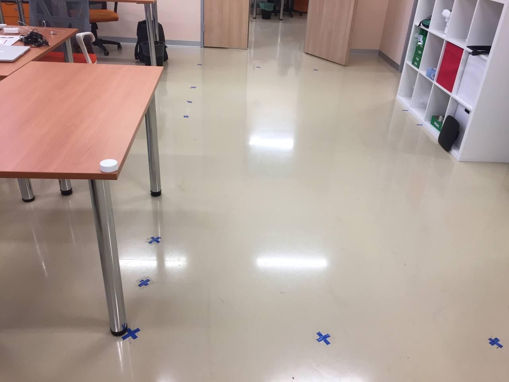
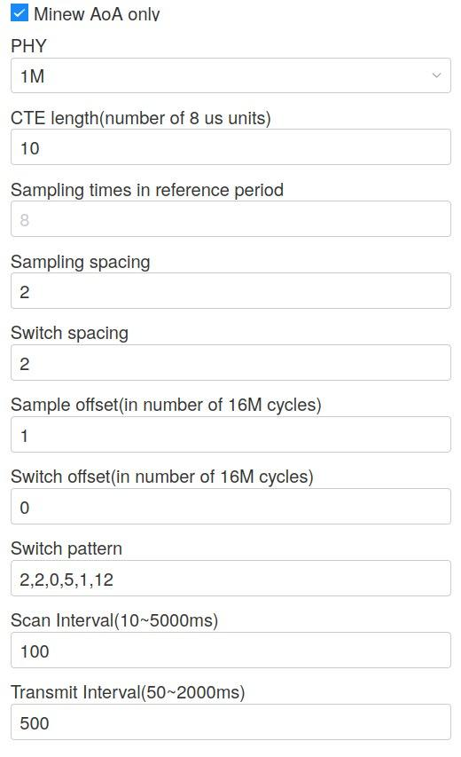
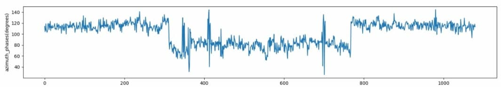

This demo project shows how using raw IQ samples obtained from the Minew Aoa Locator, you can get the azimuth and elevation angles at which the beacon is located. Using these angles, we also get the position of the beacon in XY coordinates (knowing the location of the locator in the same coordinate system). This project is based on our [AoA article](https://navigine.com/blog/using-angle-of-arrival-for-direction-finding-with-bluetooth/) in which we determined the azimuth angle using 2 adjacent elements of the linear antenna array of the locator.

## Getting started

To start the project, you need to submit raw IQ samples to the algorithm input:

```
 cd src/
 cat ../data/static.json | python3 aoa_demo.py 
```

At the output, we get the calculated angles and coordinates:

```
x_beacon:9.232542418733246, y_beacon:5.490652286174913
azimuth_angle:43.0, elevation_angle:-17.0
x_beacon:9.25956555622026, y_beacon:5.517626370851988
azimuth_angle:42.0, elevation_angle:-19.0
x_beacon:9.089259754493328, y_beacon:5.665581413837454
azimuth_angle:46.0, elevation_angle:-15.0
x_beacon:9.533823456356725, y_beacon:5.396157120924992
azimuth_angle:46.0, elevation_angle:-14.0
x_beacon:9.653014740958174, y_beacon:5.272770867998707
azimuth_angle:44.0, elevation_angle:-16.0
x_beacon:9.374720054161077, y_beacon:5.44537787620972
azimuth_angle:45.0, elevation_angle:-16.0
x_beacon:9.402449692489892, y_beacon:5.47492352570238
azimuth_angle:45.0, elevation_angle:-16.0
x_beacon:9.402449692489892, y_beacon:5.47492352570238
azimuth_angle:42.0, elevation_angle:-18.0
x_beacon:9.156849906593791, y_beacon:5.5825730485361875
azimuth_angle:46.0, elevation_angle:-14.0
x_beacon:9.653014740958174, y_beacon:5.272770867998707
azimuth_angle:44.0, elevation_angle:-15.0
x_beacon:9.475271358924696, y_beacon:5.333235601052133
...
```

The beacon was located relative to the locator as follows:



Locator settings:



## Problems in calculating the AoA 

In the stationary test, everything is fine, but if you carry out the following experiment: first the beacon lies in place, then it moves a little from side to side, and at the end - it lies in the same place again, then a strange effect is observed: during this small movement, a constant offset by some angle. This movement is expected to be close to stationary and therefore the angle should be approximately the same, but this is not the case.

In support of my words, I attach a video of the experiment:

And a figure of the change in azimuth phases:



The input data is located in the file: `dynamic.json`
